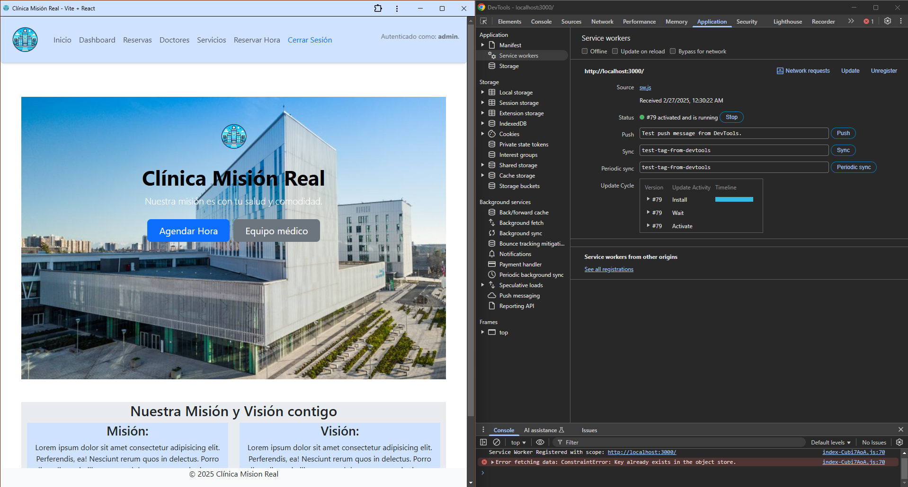

# Clínica Misión Real
========================================

El proposito del proyecto es brindar una solucion a la Clínica Misión Real para solucionar su falta de presencia en línea. Para esto se ha creado una página web estática y responsiva que refleja la identidad del hospital, con información sobre los servicios médicos, el equipo médico, la ubicación de la clínica, redes sociales para contactarse y conectar de más formas, y con una sección de testimonios de los mismos paciente para demostrar que la preferencia del público.

### Características Principales:
* Implementación de usuarios `admin` y `user`, los cuales tienen distintos permisos par acceder a elementos y funciones de la página:
    - Sin haber iniciado sessión, el sitio da acceso a:
        - **Home Page**
        - **Doctores**
        - **Servicios**

    - `admin`: el menú de navegación da accesso a:
        - **Inicio**: vista al home page.
        - **dashboard**: información de cada departamento (presupuestos y personal).
        - **Reservas**: Permite buscar las citas de pacientes existentes en la base de datos.
        - **Doctores**: Muestra la lista de doctores con funcionalidades adicionales del `admin` como agregar nuevos doctores, y en el pop-up modal está toda información existente en la base de datos sobre el doctor y los botones para agendar hora, editar y eliminar al doctor de la base de datos.
        - **Servicios**: Lista de servicios de la clínica, da la opción de obtener la ubicación del usuario (latitud y longitud).
        - **Reservar Hora**: Formulario para agendar una cita al doctor, la que después se muestra en la página dinámicamente.
    - `user`: el menú de navegación da accesso a:
         - **Inicio**: vista al home page.
         - **Doctores**: Muestra la lista de doctores. Como `user`, la página sólo muestra la lista de doctores y en el pop-up modal sólo cierta información del doctor y el botón para de agendar hora
         - **Servicios**: Lista de servicios de la clínica, da la opción de obtener la ubicación del usuario (latitud y longitud).
         - **Reservar Hora**: Formulario para agendar una cita al doctor, la que después se muestra en la página dinámicamente.


## Especificaciones Técnicas
### IN DEVELOPMENT: Implementación Tailwindcss framework
* Branch en desarrollo que pretende reemplazar Bootstrap por Tailwind CSS Framework.


### Implementación React
* Esta branch del proyecto explora la implementación de React.js para la página web de la clínica, con el objectivo de desarrollar una aplicación web interactiva y eficiente. Se crean componentes reutilizables para distintas secciones de la web del hospital, usando JSX para renderizar datos y manejar el flujo de información con props. También se utilizan Hooks (como useState y useEffect) y formularios para manejar la interacción del usuario. React crea su propia representación del DOM como un objeto JavaScript. Siempre que hay un cambio en el DOM, el framework hace una copia de este objeto JavaScript, realiza los cambios en esa copia y compara los dos objetos JS para ver qué ha cambiado, este proceso se llama “diffing”. Luego, informa al navegador sobre estos cambios y solo se vuelven a pintar esas partes del DOM. Realizar cambios en objetos JavaScript y compararlos es mucho más rápido que intentar hacer lo mismo con DOM. Dado que esta copia del DOM se almacena en la memoria como un objeto JavaScript.

### React Router
* En aplicaciones React se puede utilizar React Router DOM para la navegación para proteger las rutas sensibles, permitiendo solo a los usuarios autenticados acceder a ellas. Esto se puede hacer implementando Rutas Protegidas.

### Crypto-JS
* Para encriptar datos sensibles aplicando cifrado antes de que lleguen al backend.

### DOMpurify
* Para repeler ataques Cross-Site-Scripting.

### Axios API Requests
* Se empieza a aplicar la librería Axios para hacer peticiones fetch a una API simulada (existente en el directorio public del proyecto). Axios tiene un manejo de errores y traspaso a JSON automático, cancelación de solicitudes simples, tiene soporte de timeout, y una configuración avanzada amplia. A pesar de que requiera instalación y aprender sintaxis nueva, las ventajas de su uso motivan su implementación en el proyecto.

* Axios se encarga de manejar los permisos del `admin` para manipular la base de datos de doctores mediante llamadas GET, POST, DELETE y PUT.

* **UPDATE**: Simulación de error desactivada para asegurar el funcionamiento de la web app como PWA.
Se simula un error al cargar la lista de doctores para observar los mensajes de error desplegados por la página (.3 % de las veces). Cuando la página falla al cargar la lista, se despliega un mesaje de error en rojo y existe un botón para refrescar la lista y poder obtener a los médicos.

### json-server & json-server-auth
* Se implementa un servidor json local para almacenar la base de datos. Se refactorizan los archivos `.json` en un solo archivo `db.json` y se levanta un servidor con él.

### Descargar como PWA
* La aplicación web ahora se puede descargar como una *Progressive Web Application (PWA)* con el objetivo de ofrecer algunas ventajas como funcionalidad offline a través del uso del caché. Para que la web app funcione como PWA se realizaron las siguientes implementaciones:

    - **Manifiesto**: se crea un manifiesto con los campos escenciales para operar.
        - name
        - short_name
        - description
        - start_url
        - display
        - theme_color
        - background_color
        - icons (48x48, 72x72, 96x96, 144x144, 192x192, 512x512)
    
    - **Service Worker**: Registro de un service worker script (sw.js) para habilitar el funcionamiento offline y la gestión del caché. Este script se encarga de almacenar en la memoria caché los componentes y archivos necesarios para el funcionamiento básico de la aplicación. En concreto para esta aplicación web, se almacenan en caché lo necesario para desplegar la página de bienvenida y la vista de user de la lista de doctores.

    - **Estrategias de Almacenamiento de Caché**: Se implementan dos estrategias, una actualmente en funcionamiento
        - *Stale-While-Revalidate*: **En funcionamiento**. El Service Worker carga primero los recursos del caché, mientras actualiza la versión en segundo plano desde la red.
        - *Cache-First*: Se priorizan los recursos del caché, solo se realiza una solicitud a la red si no se encuentra el recurso en caché.
        - *Network-First*: Se intenta primero obtener los recursos de la red, y si la solicitud falla (por ejemplo, si no hay conexión), se busca en el caché.

    - **Creación build**: Para asegurar el funcionamiento de la web app como WPA, primero se hace una build de la aplicación y se sirve en un servidor.

    - **LocalStorage Web Storage Object**: Almacena datos de usuario, en este caso las credenciales (ya sea `admin` o `user`) para que persista incluso después de recargar la página o en modo offline.

    - **IndexedDB Web Storage Object**: Se implementa una base de datos con IndexedDB para manejar datos más complejos o a mayor escala como lo es la base de datos que contiene los doctores, citas con doctores, servicios y datos seguros.

    - **Pruebas de Funcionamiento Offline con *Google Lighthouse***: Actualmente, la capacidad de *Google Lighthouse* para realizar pruebas en PWAs está deprecada. Las herramientas de desarrollador de *Google Chrome* permiten chequear y debug el estado del Service Worker, el manifiesto, y la instalavilidad de la aplicación web.

    


## Para Abrir el proyecto
### Visitar Repositorio
* https://github.com/Veehto/EvaluacionM2/tree/React-branch
* Asegurarse de que descargar proyecto desde rama **React-branch**.

### Clonar Repositorio desde GitHub con CLI
```
git clone --branch React-branch https://github.com/Veehto/EvaluacionM2.git tu_carpeta
cd tu_carpeta
code .
```

### Montar Servidor para la Base de Datos
* Dentro de la carpeta de trabajo y en otro terminal:
```
npm run server
```
 Los endpoints para los recursos están en las siguientes rutas:

Endpoints:
* index
```
http://localhost:3001/
```

* Resources
```
http://localhost:3001/doctors
http://localhost:3001/appointments
http://localhost:3001/patients
http://localhost:3001/services
http://localhost:3001/secure-data
```

### Intalar paquetes necesarios con npm y montar el servidor local (Development)
* Dentro de la carpeta de trabajo:
```
npm install
npm run dev
```
La aplicación estará disponible en `http://localhost:5173`.

* Copiar la URL y pegar en el buscador del explorador web, o bien escribir en la consola la letra 'o' + ENTER, lo que abrirá el explorador web por defecto con la URL del servidor local.


### Montar servidor local (Distribution)
* Para crear una build, es decir para compilar el proyecto y crear una carpeta `dist`, ejecuta el siguiente comando:
```
npm run build
```

* Levantar un servidor con el paquete `serve`, instalándolo localmente en el proyecto o de forma global con la bandera `-g`
```
npm install -g serve
serve -s dist
```

La aplicación estará disponible en `http://localhost:3000`.

### Instalar PWA
* Al abrir la web app, el navegador dará la opción para instalar la aplicación al dispositivo (esquina superior derecha del navegador).

* Al instalar, se abrirá la aplicación de forma independiente del explorador y se creará un acceso directo en el escritorio del dispositivo.


### Credenciales
* En vista a que este es un proyecto de aprendisaje (sin datos que en verdad sean sensibles), se otorgan las credenciales para acceder al sitio como `user` y `admin` aquí:

    * user: `admin` 
      password: `password` 

    * user: `user` 
      password: `contrasena` 

## Estructura del proyecto:
```
.
├── dist (gitignored)
├── node_modules (gitignored)
├── public/
│   ├── icons/
│   ├── images/
│   ├── db-backup.json
│   ├── db.json
│   ├── frontis-clinica.jpg
│   ├── indexedDB'cjs.js
│   ├── manifest.js
│   ├── sw.js
├── src/
│   ├── assets/
│   │   └── images/
│   ├── components/
│   │   ├── AppointmentForm.jsx
│   │   ├── Appointments.jsx
│   │   ├── ConfirmationModal.jsx
│   │   ├── DoctorCard.jsx
│   │   ├── DoctorForm.jsx
│   │   ├── DoctorList.jsx
│   │   ├── DoctorListContent.jsx
│   │   ├── DoctorModal.jsx
│   │   ├── EditDoctorForm.jsx
│   │   ├── GetLocation.jsx
│   │   ├── Narrative.jsx
│   │   ├── Notification.jsx
│   │   ├── Overlays.jsx
│   │   ├── ServiceList.jsx
│   │   ├── StausMessage.jsx
│   │   └── WelcomeHero.jsx
│   ├── contexts/
│   │   ├── AuthContext.jsx
│   │   └── DoctorContext.jsx
│   ├── hocs/
│   │   └── HOCServices.jsx
│   ├── layouts/
│   │   ├── MainLayout.jsx
│   │   └── MainLayout.css
│   ├── routes/
│   │   ├── AppRoutes.jsx
│   │   └── SecureRoute.jsx
│   ├── services/
│   │   └── service.js
│   ├── utils/
│   │   ├── encryption.js
│   │   └── indexedDB.js
│   ├── views/
│   │   ├── AppointmentsFormView.jsx
│   │   ├── AppointmentsView.jsx
│   │   ├── Dashboard.jsx
│   │   ├── DoctorListView.jsx
│   │   ├── Home.jsx
│   │   ├── Login.jsx
│   │   └── ServiceListView.jsx
│   ├── App.css
│   ├── App.jsx
│   ├── index.css
│   └── main.jsx
├── .env (gitignored)
├── .gitignore
├── eslint.config.js
├── index.html
├── package-lock.json
├── package.json
├── README.md
└── vite.config.js
```

## Autor

- [Victor CS](https://github.com/Veehto)

# React + Vite
This template provides a minimal setup to get React working in Vite with HMR and some ESLint rules.

Currently, two official plugins are available:

- [@vitejs/plugin-react](https://github.com/vitejs/vite-plugin-react/blob/main/packages/plugin-react/README.md) uses [Babel](https://babeljs.io/) for Fast Refresh
- [@vitejs/plugin-react-swc](https://github.com/vitejs/vite-plugin-react-swc) uses [SWC](https://swc.rs/) for Fast Refresh


## PREVIOUS BRANCHES Especificaciones Técnicas PASADAS
**IMPORTANTE**: Desde este punto, se encuentran las implementaciones anteriores del proyecto presentes en las otras branches del repositorio.

* **Media Queries**: Se implementaron puntos de quebre para aplicar cambios a la página dependiendo del tamaño de la pantalla, esto permite una mejor visibilidad en dispositivos de escritorio, tabletas y celulares.

* **Implementación Sass**: Se implementa el preprocesador Sass para modularizar los estilos aplicados y hacer más llevadero futuras modificaciones. Se usa la arquitectura 7-1 para organizar los archivos parciles dentro de la carpeta sass/, el archivo main.scss importa todos los parciales.

* **Metodología BEM**: También se cambia la convención de nombres de clases en las guías de estilo a BEM, para factorizar las reglas de estilo, mejorando la comprensión del código y si reutilización.

* **Bootstrap package**: Uso del paquete de Bootstrap para agilizar e unificar la implementación del código. Se ocupan  principalmente 4 componentes: Nav Bar, Modal, Form y Carousel. También se hacen modificaciones personalizadas a algunos estilos de colores de Bootstrap, con la finalidad de ajustarse a la imagen e identidad de la clínica.

## Implementación de JavaScript
Se elige implementar JavaScript al proyecto en curso por ser la opción más pertinente considerando la mano de obra, tiempo a disposición del equipo, y familiaridad con el lenguaje. 
Otra razón importante es que el por las necesidades de la institución que precisa una página web, ésta necesitará tener una funcionalidad que permita atender las solicitudes de los visitantes y posibles futuros pacientes, sin olvidar también que el internet de hoy en día llama a la presencia de aplicaciones web, más que a la implementación de páginas estáticas, 
a menos que solamente las características de éstas últimas satisfagan las necesidades actuales del cliente.

* **Página de contactos**: Se implementan prompts para solicitar información al usuario (nombre, email, teléfono) y luego se despliega una alert para mostrar la información recién ingresada al usuario. Para evitar que el usuario omita un campo o ingrese caracteres que no corresponden (e.g., ingresar letras en el campo de teléfono), se implementa validación de datos para cada campo:
    - nombre: validación por medio de regex, asegura que sólo se ingresen letras mayúsculas o minúsculas.
    - email: asegura que el correo ingresado contenga @, .com o .cl.
    - teléfono: asegura que sólo se ingresen números.

* **Sección para Agendar Hora**: Al apretar el botón para Agendar Hora, se despliega un Bootstrap modal pop-up para elegir el tipo de consulta, tipo de ID que el usuario quiere usar, y un menú desplegable para elegir especialidad. Al clickear una especialidad, se genera dinámicamente un nuevo menú despegable con los doctores disponibles para esa especialidad. Se implementa el uso de la función fetch para obtener una lista de doctores en un archivo .json, después de tener los datos estos se convierten a un objeto JSON y se usan junto con manipulación del DOM para obtener la elección del usuario en la especialidad, que se compara iterando la lista de doctores con la key "specialty" que cada doctor tiene. Cuando encuentra coincidencias, toma los nombres de los doctores y los muestra en el nuevo menú desplegable generado dinámicamente.

### Arquitectura del Lenguaje JavaScript
* **Event Loop**: Es como el código puede ser realmente no bloqueante (non-blocking) y pasar a otras tareas mientras espera que se completen las operaciones asincrónicas. Así es como JavaScript puede emular la concurrencia (dos o más procedimientos al mismo tiempo). Las partes que forman el event loop son:
    - **Call Stack**: hace un seguimiento de qué función se está ejecutando actualmente. Cuando invoca una función, se agrega un frame al stack. Los frames conectan los argumentos de esa función y las variables locales heap. Los frames ingresan al stack en orden LIFO (último en entrar, primero en salir). La función que se ejecuta en un momento dado está en la parte superior del stack. Existe un frame global o anónimo que cuando se inicia un programa por primera vez, el contexto de ejecución global se agrega al call stack, que contiene la variable global y el entorno léxico.
    - **Heap**: El heap es un bloque de memoria donde almacenamos objetos de manera desordenada. Las variables y objetos de JavaScript (como arrays, objects o funciones) que están en uso en un momento se almacenan en el heap.
    - **Event Queue**: Es una lista de mensajes correspondientes a funciones que esperan ser procesadas. Estos mensajes ingresan al event queue desde fuentes como web APIs o funciones asincrónicas que se llamaron y devuelven eventos adicionales para que el call stack los gestione. Los mensajes ingresan al queue en orden FIFO (primero en entrar, primero en salir). No se ejecuta ningún código en el event queue; sino que contiene funciones que esperan ser agregadas nuevamente al stack.
    - **Event Loop**: Los mensajes que están esperando en el event queue para ser agregados nuevamente al call stack se agregan nuevamente a través del event loop. Cuando el call stack está vacío, si hay algo en el event queue, el event loop puede agregarlos de a uno al call stack para su ejecución.

### Variables y Scope
* **var**: Para declarar variables de las que se puede reasignar su valor. Su scope es de función, un tipo de scope local, que hace la variable disponible en cualquier parte de una función. Estas variables son suceptibles a hoisting, que es cuando la declaración de la variable se separa de su inicialización y se va al inicio de su scope (al inicio de la función a la que pertenezca o al inicio del scope global). Esto puede crear problemas al usar **var** en loops o en condiciones if, ya que el valor puede filtrarse a otras secciones de código.

* **let**: Introducida en ES6, sirve para declarar variables de las que se puede reasignar su valor. Su scope es de bloque, un tipo de scope local, que hace la variable disponible en sólo dentro del bloque {}.
* **const**: Introducida en ES6, sirve para declarar variables de las que no se puede reasignar su valor. Estas tiene que ser inicializadas con un valor al momento de ser declaradas.

### Uso de debugger
* La instrucción debugger invoca cualquier función de depuración disponible, como por ejemplo, la configuración de un punto de interrupción. Cuando se invoca el debugger, la ejecución se detiene en la instrucción del depurador. Es como un punto de interrupción en el código fuente del script. Si no hay ninguna función de depuración disponible, esta instrucción no tiene ningún efecto.

### Uso de Prompts y Validación de Datos
* El uso de la función prompt despliega una ventana pop-up en el navegador visible para el usuario y que este puede responder con información. La respuesta se puede guardar en una variable para pasar por distintos métodos de validación y procesación de la información facilitada por el usuario. En la sección **Página de Contactos** se detallan las validaciones aplicadas en este proyecto.

### Uso de Operadores Lógicos, de Comparación, de Incremento, y de Negación
* **&&**: el operador "and" chequea si dos expresiones evalúan como verdaderas (truthy) o como Boolean true. Se puede usar dentro de condiciones if, else if.
* **||**: el operador "or" chequea si una expresió evalúan como verdaderas (truthy) o como Boolean true. Se puede usar dentro de condiciones if, else if. Importante destacar que las expresiones con || siempre evalúan de izquierda a derecha, y si la expresión de la izquierda se evalúa como verdadera, la de la derecha se ignorará.
* **===**: Comparación de identidad o estricta, evalúa si coincide en tipo y valor
* **==**: comparación, ve si hay coincidencia en valor.
* **<**: menor que.
* **<=**: menor o igual que.
* **>**: mayor que.
* **>=**: mayor o igual que.
* **!==**: distinto o no igual que.
* **!**: negación o operador bang, revierte o niega el valor de un Boolean.

### Uso de try/catch
* La sentencia try siempre comienza con un bloque try. Luego, debe estar presente un bloque catch o un bloque finally. También es posible tener bloques catch y finally. Esto nos da tres formas para la sentencia try. Un bloque catch contiene instrucciones que especifican qué hacer si se lanza una excepción en el bloque try. Si alguna instrucción dentro del bloque try (o en una función llamada desde dentro del bloque try) lanza una excepción, el control se transfiere inmediatamente al bloque catch. Si no se lanza ninguna excepción en el bloque try, se omite el bloque catch. El bloque finally siempre se ejecutará antes de que el flujo de control salga de la construcción try...catch...finally. Siempre se ejecuta, independientemente de si se generó o detectó una excepción.

### Uso de Objetos JSON
* Se crea un nuevo archivo .json que funciona como la base de datos de los doctores de la cínica. El archivo se constituye de un arreglo de objetos que representa cada doctor, y las claves de cada objeto son la información de cada doctor (nombre, especialidad, experiencia, disponibilidad, info. de contacto, etc.).

* Se usa el archivo .json en el archivo JavaScript principal por medio de la API fetch, y una vez que la promesa se cumple se manipula el archivo para mostrar su información en la página.
    - **clonación**: se crea un copia de un elemento del objeto JSON que contiene los doctores y lo modifica. En este caso, se extrae un doctor del archivo .json usando el spread operator y se modifica esta copia para cambiar la disponibilidad del doctor.
    - **Merge**: fusiona el contenido de dos objetos JSON en uno nuevo. Esto lo hace tomando el objeto JSON de doctores y otro objeto llamado "services", se toman los contenidos de estos usando el spread operator, y lo almacena en una variable nueva.
    - **Recorrido**: Se recorre el objeto JSON de doctores para mostrar estos en la página al usuario de diversas formas: 
        - en el dropdown menu en la sección para reservar hora, al seleccionar una especialidad, se recorre el objeto JSON doctores y se compara con la elección de la especialidad para mostrar en otro dropdown menu los doctores para cada especialidad.
        - al seleccionar un doctor, se recorre nuevamente el objeto para obtener la información de este doctor y desplegarla en una tarjeta que incluye su foto, nombre, especialidad y horario de atención.
        - dentro del archivo JavaScript se recorre el objeto JSON de doctores aplicando a cada elemento el método estático del objeto JSON stringify() y se imprime a la consola los objetos en formato JSON.

### Uso de Estructuras de Datos
* **Arrays (Arreglos)**: se implementa un arreglo nuevo que va a almacenar distintos objetos que representan doctores, y este arreglo se almacena en una variable. El arreglo representa una lista de doctores. A este arreglo se le agregan los doctores usando el método push(), se hace una búsqueda usando el método find() para encontrar el doctor con menos años de experiencia, y se elimina un doctor de al final del arreglo usando el método pop().

* **Stacks (Pilas)**: Se simula una pila utilizando un arreglo, esto para simular cómo sería cuando los usuarios tienen más de una reserva en la clínica. Como los stacks funcionan de forma LIFO, se utiliza el método pop() para sacar la última cita en el arreglo e almacenarla en una variable. Después se imprime a la consola para mostrar la siguiente cita al doctor del paciente.

* **Queues (Colas)**: Se simula una cola utilizando un arreglo, esto para simular el orden de llegada de los pacientes. Como el orden de ejecución de las queues es FIFO, se utiliza el método shift() para sacar el primer elemento del arreglo y almacenarlo en una variable. Después se imprime a la consola para mostrar qué paciente es el siguiente.

### Uso de Algoritmos
* **Algoritmo de Búsqueda**: Se aplica el modelo de algoritmo lineal para recorrer el objeto JSON de doctores para encontrar un doctor en específico, filtrando por medio del nombre que es el parámetro que se le da a la función de búsqueda que aplica el algoritmo. La complejidad del algoritmo es O(n), ya que la búsqueda lineal se ejecuta en tiempo lineal y realiza un máximo de n comparaciones, donde n es la longitud de la lista. El tiempo de ejecución aumenta, como máximo, de forma lineal con el tamaño de los elementos presentes en la lista.

* **Algoritmo de Ordenamiento**: Se aplica el algoritmo de ordenamiento bubble sort, ya que se apunta a ordenar a los doctores de forma descendente con respecto a sus años de experiencia, esto lo hace comparando pares de elementos adyacentes y los intercambia si están en el orden correcto. La complejidad del algoritmo bubble sort tiende a ser cuadrática O(n^2) ya que tenemos que recorrer la el arreglo tantas veces como pares haya.

### Uso de Programación Funcional
* Es un paradigma de programación en JavaScript que apunta a trabajar con funciones de primera clase (las funciones pueden asignarse a variables, pasarse y referenciarse como argumentos y también retornadas por otras funciones). Se concentra en usar funciones puras, la inmutabilidad y la composición de funciones. En este proyecto se apunta a usar un enfoque más declarativo en distintas aplicaciones:
    - **curryng**: permite convertir una función con múltiples argumentos en una secuencia de funciones que reciben un argumento cada vez. En el Proyecto se utiliza para calcular el total a pagar de un paciente, sumando las citas al doctor que tenga acumuladas.
    - **Funciones Flecha**: proporcionan una sintaxis más concisa y manejan mejor el contexto de this en JavaScript.
    - **Recursión**: un patrón común en el que una función se llama a sí misma para resolver problemas más pequeños. Se utiliza para calcular las horas totales en una semana realizadas por un doctor en específico.
    - **Composición de Funciones**: permite encadenar funciones para crear nuevas funcionalidades. Se utiliza para calcular el precio después de aplicar un descuento en porcentaje.

### Uso de Programación Orientada a Eventos (EOP) y Asincronía
* Este paradigma se basa en la respuesta a eventos, lo que permite a las aplicaciones ser reactivas. Los desarrolladores pueden usar listeners para capturar eventos y desencadenar funciones específicas.

* La Asincronía en JavaScript usa un modelo basado en eventos, lo que permite realizar múltiples tareas sin bloquear la ejecución. Se utiliza para buscar el archivo JSON en el proyecto e imprimirlo en la consola. En el proyecto se utiliza la sintaxis async/await para simplificar el manejo de código asincrónico, también evita el anidamiento excesivo de callbacks.

### Uso de Programación Orientada a Objetos (OOP)
* es un paradigma que organiza el código en torno a objetos, que representan entidades
del mundo real. Los objetos tienen propiedades (datos) y métodos (funciones). En el proyecto se ponen en práctica distintos principios en el uso de Clases:
    - **Herencia**: Permite que las clases hereden características de otras. En el proyecto se crea una Clase padre Doctor y se heredan propiedades para la clase hijo Surgeon.
    - **Encapsulación**: Esconde detalles internos y exponer solo lo necesario. Pone cierta  capa de verificación a criterio del desarrollador, tratando de guiar el cambio de propiedades dentro de ciertas condiciones. En el proyecto se aplica para dar una capa de verificación al fijar los años de experiencia de los doctores, cuidando que siempre sean números positivos (mayores a 0).
    - **Polimorfismo**: Permitir que los métodos se comporten de manera diferente según el contexto.